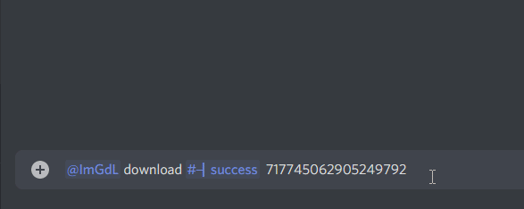

# imGdL ☁
a Discord bot to recursively download images from a Discord channel

## Demo

  

## Reference
- Invite Link: https://fyko.net/bot?id=530204772633018378&p=116736

## Usage
After inviting the bot to your server with the link above, you can follow the command structure below to begin downloading images:
> `dl!download #channel 718204818119852124`

The first argumen being the channel you'd like to download the images from, and the second being the oldest message you'd like to fetch. If you don't provide a second argument it will do the whole channel.

Once making it through the queue, you'll be notifited and updated throughout the downloading, zipping and uploading process. 

After downloading all the images and creating a ZIP, it'll be uploaded to Amazon S3, a cloud file-storage service.

**After 72 hours, the download link will be invalidated and the file will be deleted.**

## How it (downloading) Works
After the user runs the download command and permissions are checked, a new Download class is initialized and added to the DownloadManager queue. The queue is necessary since Cloudflare will ratelimit after 50 images have been downloaded, so the function will take a 3.5 second break every 50 images. If there are multiple downloads running at the same time -- and they're both taking 3.5 second breaks every 50 images -- semantically, that's a break every 100 images, which is not compliant with the ratelimit and will result in a dumpsterfire. 

As each image is being downloaded, the Response#body stream is being piped into a Write Stream in a temp. dir -- doing it this way is signifigantly more resource friendly. Per my testing, the Response#body can't be piped directly into the ZIP stream and results in corrupted images. Once all the images are downloaded, a new archive is initialized with [archiver](https://yarn.pm/archiver). A Read Stream is created for each image and is appended to the archive. Once all images have been appended, the archive is finalized and creates a {{uuid}}.zip file.

If the file is under 8Mb, it can be uploaded directly to Discord. Else, it's uploaded to Amazon S3 with a 3 day expiration time.

## Self Hosting
Although there are self hosting instructions, I will not be providing support on the topic.

1. Rename `.env.example` to `.env` and fill in all necessary fields (there are descriptions for each)  
2. Run `docker-compose up` to start the service and `docker-compose up -d` to run detached (in the background)  
3. If running detached, you can stop the service with `docker-compose down` 

## Funding
Running this bot isn't free, especially with the additional Amazon S3 fees. Although not required, [a coffee](https://ko-fi.com/fykos) would be greatly appreciated.

## README from template repository

# Discord Bot Template
This Discord bot template uses the following technologies:
* [PNPM](https://pnpm.js.org/) (package manager)
* [Docker](https://docker.com/) (secure, isolated container)
* [MongoDB](https://mongodb.com/) (noSQL database)
* [Discord.js](https://discord.js.org/) (Discord API interaction)
* [Discord Akairo](https://discord-akairo.github.io/) (Discord bot command handler)
* [Discord.js/collection](https://github.com/discordjs/collection) (database caching)

## Preamble
This project uses [pnpm](https://pnpm.js.org) in place of npm or yarn to install dependencies.
I would strongly reccomend you switch to pnpm for all your projects, big and small.
> pnpm uses hard links and symlinks to save one version of a module only ever once on a disk. When using npm or Yarn for example, if you have 100 projects using the same version of lodash, you will have 100 copies of lodash on disk. With pnpm, lodash will be saved in a single place on the disk and a hard link will put it into the node_modules where it should be installed.
> 
> As a result, you save gigabytes of space on your disk and you have a lot faster installations! If you'd like more details about the unique node_modules structure that pnpm creates and why it works fine with the Node.js ecosystem, read this small article: Flat node_modules is not the only way.

## Usage
1. Install dependencies  with `pnpm install`
2. Rename `.env.example` to `.env` and set each value accordingly
3. Update lines 3-7 in the [Dockerfile](https://github.com/Fyko/bot-template/blob/master/Dockerfile#L3-L7)
4. Build app with `pnpm run  build`
5. Start app with `node .`
> you can  also build & start with `pnpm start`
